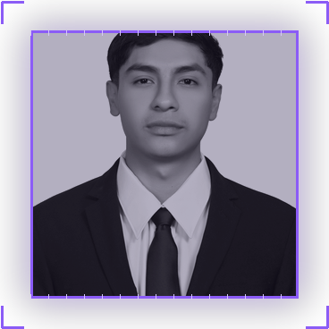

<div align="center">



<br/><br/>



<br/><br/>

[](https://git.io/typing-svg)

<br/>


<br/><br/>



</div>

<br/>

## About Me



I'm **Gerónimo Murillo**, a Full Stack Developer from Mexico 🇲🇽, working under my own brand **Seventeen Corp**.

My work is built on a Linux-first environment, using **Python** and **Django** to design solid backends, and **Next.js** to ship fast, modern interfaces. I connect that with **n8n + AI** to automate repetitive business processes, and package everything with **Docker** for consistent, reproducible deployments.

I care about clean architecture, readable code, and systems that are simple to operate — not just simple to build.

- Daily driver: **Linux**
- Backend: **Python**, **Django**, **PostgreSQL**
- Frontend: **Next.js**, **React**, **TypeScript**, **Tailwind CSS**
- Automation: **n8n + AI**
- DevOps: **Docker**, **Git**, **GitHub**, **Vercel**

<br clear="right"/>

## Portfolio

<div align="center">

[](https://omurillo17.github.io)

</div>

<br/>

## Core Stack

<div align="center">

**Operating System**


**Backend**


**Frontend**


**Automation**


**DevOps**


**Programming**


</div>

<br/>

## Featured Projects

<table width="100%">
  <tr>
    <td width="50%" valign="top">
      <h3>AssistantAI</h3>
      <p>Automation-driven assistant that streamlines business workflows using <b>n8n + AI</b>, with a Django backend and a Next.js interface, shipped in Docker.</p>
      <p>
        
        
        
      </p>
      <a href="https://github.com/omurillo17/assistant-ai">View Repository →</a>
    </td>
    <td width="50%" valign="top">
      <h3>Desechables Estrella</h3>
      <p>Corporate website built for a disposable-products company, focused on performance, SEO and a clean, modern presentation.</p>
      <p>
        
        
        
      </p>
      <a href="https://github.com/omurillo17/desechables-estrella">View Repository →</a>
    </td>
  </tr>
  <tr>
    <td width="50%" valign="top">
      <h3>Alzheimer Prediction</h3>
      <p>Machine Learning project built in Python to model and predict Alzheimer's progression indicators from clinical data.</p>
      <p>
        
      </p>
      <a href="https://github.com/omurillo17/alzheimer-prediction">View Repository →</a>
    </td>
    <td width="50%" valign="top">
      <h3>Seventeen Corp</h3>
      <p>Personal software development brand and workspace for independent projects, experiments and client work.</p>
      <p>
        
        
      </p>
      <a href="https://omurillo17.github.io">View Portfolio →</a>
    </td>
  </tr>
</table>

<br/>

## GitHub Stats

<div align="center">


<br/>


</div>

<br/>

## Contribution Snake

<div align="center">


</div>

<br/>

## Connect

<div align="center">

[](https://github.com/omurillo17)
[](https://linkedin.com/in/geronimocong/)
[](mailto:oscxrma@gmail.com)
[](https://omurillo17.github.io)

</div>

<br/>

<div align="center">

```
Code.
Automate.
Improve.
Repeat.
```


<sub>Gerónimo Murillo · Seventeen Corp · Mexico 🇲🇽</sub>

</div>
